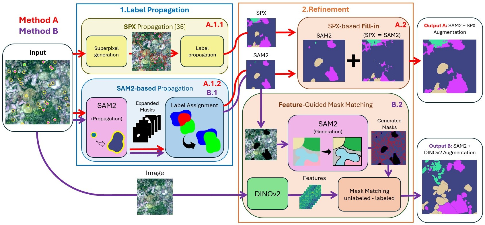

# Repository for Point-Label Augmentation

Software tool part of my master's thesis: Leveraging foundation models to improve weakly supervised segmentation models in wildlife monitoring applications.

In this work, we explore label augmentation focusing on the next challenge: generate a "dense" semantic segmentation of an underwater image from a set of sparse point-level labels provided by an expert. Our approach is built upon SAM2 segmentation and DINOv2 features extraction capabilities. It starts with the propagation of all sparse point-labels across the image which is followed by a posterior refinement of the propagated segmentation by predicting labels for the remaining unlabeled pixels. As result, we generate a dense semantic segmentation from minimal annotations.



<a name="installation"></a>
## Installation

We suggest using Anaconda package manager to install dependencies.

  1. Clone this repository
  2. Download Anaconda (or miniconda)
  3. Create Anaconda environment from labelex.yml environment file:
     
  ```conda env create -f environment.yml ```
  
  3. Activate the environment:
     
  ```conda activate plaenv```

  <a name="getting-started"></a>
  ## Getting Started

  ### SAM2

  First, clone the [SAM2 repository](https://github.com/facebookresearch/sam2).

  ### Point Label Aware Superpixels

  Next, clone the [Point Label Aware Superpixels repository](https://github.com/sgraine/point-label-aware-superpixels).
  From this repository, copy the following scripts into the `sam2/` directory:  
  - `snn.py` – Implements superpixel-based label propagation.  
  - `spixel_utils.py` – Provides utility functions for working with superpixels.
  -  **Superpixel Feature Extractor Weights** – Download the required weight file (`standardization_C=100_step70000.pth`) from the link provided in the repository and place it in `sam2/`.

  clone Point Label Aware Superpixels. Place snn.py and spixel_utils.py in same directory as label_augmentation.py

  ### File Structure

  ```plaintext
  PL_augmentationn/
  │── sam2/                                      # Cloned SAM2 repository
  │   ├── ...                                    # Other SAM2 files
  │   ├── label_augmentation.py                  
  │   ├── snn.py                                 # Copied from Point Label Aware Superpixels
  │   ├── spixel_utils.py                        # Copied from Point Label Aware Superpixels
  │   ├── standardization_C=100_step70000.pth    # Downloaded model weights
  ```

  ### Prepare the input data

  Ensure you have a folder with the images and a .csv file with the point labels coordinates of those images in the form:

  ```
  Name,Row,Column,Label
  name_img1.png,241,280,4
  name_img1.png,392,44,12
  name_img1.png,51,119,4
  ...
  name_img2.png,239,302,4
  name_img2.png,218,480,12
  name_img2.png,267,255,34
  ...
  name_imgN.png,496,128,34
  name_imgN.png,496,128,34
  name_imgN.png,421,429,34
  ...
  ```

  If you want the segmentations to be in color, ensure you have a color_dict.csv file that map each different semantic classes/labels with an RGB tuple. First row contains the class, while second, third and fourth rows contains R, G and B respectively.

  ```
  0,1,2,3,4,5,6,7
  63,0,0,0,255,255,255,255
  69,0,255,255,0,0,255,255
  131,255,0,255,0,255,0,255
  ```

  ### Run the script

  ```
  python label_augmentation.py -i <images_dir> -o <output_dir> -pl <point_labels_file>.csv --color_dict <color_dict_file>.csv -b <background_class> -n <num_different_classes>

  ```


